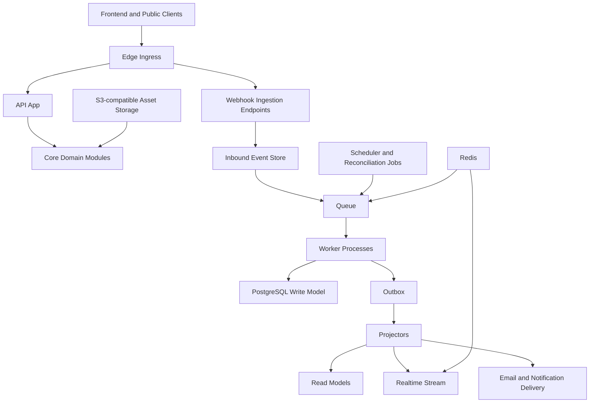
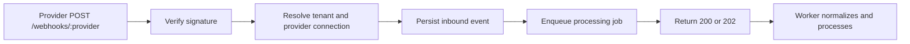
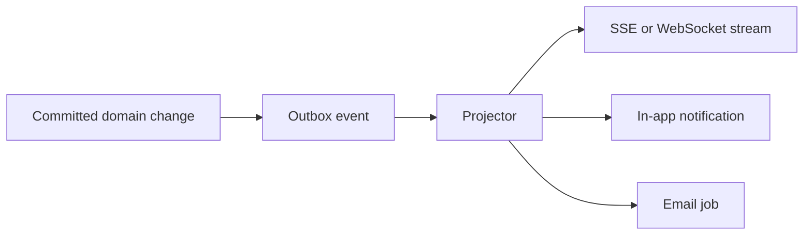

# Festify Affiliates Backend Architecture

Last updated: 2026-04-07 (refined with gap analysis)

## Source note

This document is based on the Festify Affiliates PRD content in the supplied PDF. Only the PRD sections are used. The later pages in the PDF include unrelated transcript content and are intentionally ignored.

This backend architecture is also aligned with the existing frontend architecture document at [frontend-architecture.md](/Users/vishalpatil/Festify%20Affiliate%20System/docs/frontend-architecture.md).

## 1. Product context

Festify Affiliates is not a CRUD SaaS backend. It is a multi-tenant attribution and affiliate operations platform for event organizers, with these hard requirements:

- Third-party ticketing integrations drive core business events
- Sales attribution must be accurate and explainable
- Commission and payout data are financially sensitive
- White-label tenancy affects domains, branding, emails, and permissions
- Webhook delivery is unreliable by default and must be treated as at-least-once
- Dashboards need fast aggregated read models, not only raw transactional queries
- Refunds and corrections must be reversible and auditable

The backend therefore needs to behave like an event-driven financial processing system with strong auditability, not just a set of controller-service-repository endpoints.

## 2. Architecture goals

The backend must be:

- Integration-first
- Idempotent under retries and duplicate delivery
- Financially correct and auditable
- Multi-tenant safe
- Event-driven where side effects matter
- Operationally simple enough to ship quickly
- Scalable in workers and read models without forcing premature microservices

## 3. Corrections to the initial backend proposal

Your proposal is strong in direction, but several important changes are needed to make it production-safe.

### 3.1 Do not start with distributed microservices

The proposed "Auth Service", "Affiliate Service", "Campaign Service", and similar boxes should not become separately deployed services on day one.

For Festify, the better starting point is:

- modular monolith for synchronous application logic
- separate worker processes for async jobs
- separate scheduler process for polling and reconciliation

Why:

- transaction boundaries stay simple
- financial writes stay consistent in one database
- developer velocity stays high
- infra complexity stays reasonable

This is still serious backend architecture. It is not "small." It is the right level of distribution for this phase.

### 3.2 The system needs an immutable financial record, not only mutable rows

The initial design has `sales`, `commissions`, and `payouts`, but financial correctness requires more than row updates.

Add:

- immutable commission ledger entries
- payout line items
- adjustment and reversal entries
- raw inbound event log
- audit trail for operator actions

Without this, refund clawbacks and payout disputes become painful to explain.

### 3.3 Idempotency must exist at more than one layer

`unique(event_id)` is necessary but not sufficient.

The backend needs:

- ingress dedupe for inbound webhook events
- idempotent workers for processing steps
- unique constraints on business records like provider order ids
- dedupe on outbound side effects where needed

### 3.4 A queue alone is not enough; use inbox and outbox patterns

The initial proposal uses queues well, but a production backend should persist:

- inbound event receipt before processing
- outbound domain events after database commit

This gives us:

- replayability
- safer retries
- no lost notifications after successful writes

### 3.5 The affiliate data model needs separation between person and campaign membership

The proposed `affiliates` table keyed directly to `event_id` does not scale to the PRD requirement that an affiliate may eventually work across multiple events.

Use:

- `affiliate_accounts` for the person or login identity
- `campaign_affiliates` for campaign participation

This avoids duplicating the same affiliate identity across events.

### 3.6 Real-time updates should be fed from committed domain events, not direct worker pushes

Do not let workers write to the database and also push WebSocket events as an ad hoc side effect.

Instead:

- write DB changes in a transaction
- publish outbox event
- realtime projector delivers SSE or WebSocket update

This prevents the UI from seeing changes that were never committed or missing changes that were committed.

### 3.7 Reconciliation is a first-class subsystem, not a fallback afterthought

Ticketing providers will miss webhooks, redeliver late, or change payloads.

So the backend needs:

- provider sync cursors
- polling jobs
- replay tools
- reconciliation reports

This is not optional for financial attribution.

## 4. Recommended macro architecture



## 5. Deployment shape

Start with one codebase and multiple process types:

- `api`: synchronous HTTP app for frontend APIs, auth endpoints, public application flow, admin APIs, and webhook ingress
- `worker`: async job processor for attribution, commissions, milestone evaluation, notifications, and projections
- `scheduler`: polling, reconciliation, digest jobs, stale sync detection

This can run on:

- Vercel for frontend
- AWS ECS/Fargate, Railway, Render, or Fly for backend process types
- PostgreSQL for primary state
- Redis for queues, locks, and pub/sub
- S3-compatible storage for assets

### Recommended stack

If staying TypeScript end-to-end:

- Node.js + TypeScript
- Fastify or NestJS for the API app
- BullMQ on Redis for jobs at MVP and early scale
- PostgreSQL as the source of truth

Important:

- Kafka is not required on day one
- a separate API Gateway product is not required on day one
- use a simple ingress or load balancer unless org-wide infra standards require more

## 6. System planes

The backend is easier to reason about if we split it into planes.

### 6.1 Control plane

Owns:

- organizers
- domains
- branding
- users and memberships
- campaign setup
- affiliate applications
- asset management
- integrations configuration
- notification preferences

### 6.2 Data plane

Owns:

- webhook ingestion
- polling ingestion
- canonical event creation
- attribution
- sales records
- commission ledger
- milestones
- payouts
- projections and analytics

### 6.3 Delivery plane

Owns:

- email delivery
- in-app notifications
- realtime updates
- export generation

## 7. Core domain modules

The backend should be modular by domain, even if deployed as one application.

| Module | Owns |
| --- | --- |
| `identity` | users, sessions, invites, passwordless or SSO integration |
| `tenants` | organizers, domains, branding, tenant config |
| `campaigns` | affiliate campaign lifecycle, commission config, attribution windows |
| `affiliate-applications` | application intake, review queue, approval/rejection |
| `affiliate-accounts` | affiliate profile and login identity |
| `campaign-affiliates` | affiliate participation per campaign, referral codes, overrides |
| `tracking` | referral links, click sessions, UTMs, discount code mappings |
| `integrations` | provider connections, webhook verification, provider adapters, cursors |
| `sales-ingestion` | inbound raw events, canonical event creation, processing state |
| `attribution` | claim resolution, self-referral checks, duplicate prevention |
| `commissions` | rule resolution, ledger entries, commission balances |
| `milestones` | definitions, progress, unlock events, manual approvals |
| `payouts` | payout batches, payout items, paid and failed states |
| `assets` | asset metadata, versions, broadcasts, download tracking |
| `communications` | broadcast messages, digests, notification preferences |
| `risk` | fraud signals, anomaly scoring, manual review flags |
| `feature-flags` | rollout controls, tenant-scoped flags, safe migrations |
| `realtime` | domain event fanout to SSE or WebSocket clients |
| `reporting` | read models, aggregates, exports |
| `ops` | reconciliation, replay, audit, admin tooling |

## 8. External interfaces

The backend should expose five interface groups.

### 8.1 Frontend application APIs

Used by:

- organizer admin panel
- affiliate portal
- public application flow

Style:

- typed REST endpoints or RPC-style JSON endpoints
- stable pagination/filter contracts
- aggregated read endpoints for dashboards

### 8.2 Webhook ingress APIs

Used by:

- Luma
- Bizzabo
- GevMe
- generic webhook senders

Requirements:

- signature validation
- tenant and provider connection resolution
- request size limits
- replay protection
- fast acknowledgment after persistence

### 8.3 Polling and backfill connectors

Used by:

- providers without reliable webhooks
- reconciliation jobs
- support tooling for manual replays

### 8.4 Realtime stream

Used by:

- organizer dashboards
- affiliate portal

Recommendation:

- start with SSE for one-way dashboard updates
- preserve a transport abstraction so WebSocket can be introduced later

### 8.5 Internal ops APIs

Used by:

- support tools
- replay utilities
- reconciliation jobs
- admin dashboards

## 9. Integration architecture

### Adapter pattern

Every ticketing provider should be isolated behind a capability-specific adapter.

```text
src/modules/integrations/
  core/
    adapter.ts
    canonical-event.ts
    signature.ts

  luma/
    adapter.ts
    webhook-handler.ts
    poller.ts
    mapper.ts

  bizzabo/
    adapter.ts
    webhook-handler.ts
    poller.ts
    mapper.ts

  gevme/
    adapter.ts
    webhook-handler.ts
    poller.ts
    mapper.ts

  generic-webhook/
    adapter.ts
    webhook-handler.ts
    mapper.ts
```

### Provider contract

Each adapter should implement methods like:

- `verifySignature`
- `parseWebhook`
- `fetchSinceCursor`
- `normalizeEvent`
- `extractReplayKey`
- `supportsWebhooks`
- `supportsPolling`

### Important correction

Do not let provider-specific shapes leak into the rest of the system. Only canonical events leave the integration boundary.

## 10. Canonical event model

The initial normalized event example is a good start, but it needs stronger metadata and safer semantics.

### Money model

All monetary values should use a strict money type.

Rules:

- never use floating point for money
- store money in minor units in the write model
- transport money as strings over JSON if precision could exceed JavaScript safe integers
- always carry currency and exponent metadata

Recommended type:

```ts
type Money = {
  amountMinor: string;
  currency: string;
  exponent: number;
};
```

Examples:

- USD 12.34 => `amountMinor = "1234"`, `currency = "USD"`, `exponent = 2`
- JPY 1200 => `amountMinor = "1200"`, `currency = "JPY"`, `exponent = 0`

All commission, refund, payout, and reporting calculations should operate on this money primitive or a dedicated money library built around the same rule set.

### Event versioning

Every canonical event and every outbox domain event must be versioned.

Rules:

- event type names are stable
- schema changes are additive whenever possible
- breaking payload changes require a new version
- workers and projectors may temporarily support multiple versions during rollout

Recommended envelope:

```ts
type DomainEvent<TPayload> = {
  id: string;
  tenantId: string;
  aggregateType: string;
  aggregateId: string;
  type: string;
  version: number;
  occurredAt: string;
  correlationId?: string;
  causationId?: string;
  payload: TPayload;
};
```

### Recommended canonical ticket event

```ts
type CanonicalTicketEvent = {
  id: string;
  version: 1;
  source: "webhook" | "poller" | "manual_import";
  provider: "luma" | "bizzabo" | "gevme" | "generic";
  providerConnectionId: string;
  tenantId: string;
  campaignId?: string;
  type:
    | "ticket.purchased"
    | "ticket.refunded"
    | "ticket.updated"
    | "order.cancelled";
  externalEventId?: string;
  externalOrderId: string;
  externalLineItemId?: string;
  occurredAt: string;
  observedAt: string;
  correlationId?: string;
  causationId?: string;
  gross: Money;
  refunded?: Money;
  buyer: {
    emailHash?: string;
    countryCode?: string;
  };
  referral: {
    referralCode?: string;
    referralToken?: string;
    utmSource?: string;
    utmMedium?: string;
    utmCampaign?: string;
    clickId?: string;
    landingUrl?: string;
  };
  rawEventRef: {
    inboundEventId: string;
  };
};
```

### Why this is better

- captures provider and connection identity
- separates observed referral evidence from resolved affiliate identity
- supports partial refunds and line items
- avoids storing raw buyer PII as business logic input unless needed
- is safe for schema evolution
- uses precise money semantics

## 11. Ingress and ingestion flow

### Webhook flow



### Required ingress steps

1. Read raw request body
2. Verify signature or authentication secret
3. Resolve provider connection and tenant
4. Compute replay key
5. Persist raw inbound event before processing
6. Enqueue async processing
7. Acknowledge quickly

### Inbound event store

Persist:

- provider
- provider connection id
- external event id if present
- replay key hash
- raw payload
- headers subset
- signature validity
- received at
- processing status
- first processed at
- last error

### Important rule

Do not process business logic inline in the webhook request path.

## 12. Delivery semantics

This system must be designed for:

- at-least-once inbound delivery
- at-least-once queue processing
- idempotent consumers

Exactly-once delivery is not realistic across webhooks, queues, and workers. The correct design response is idempotency plus immutable audit state.

### Formal idempotency strategy

Idempotency must be defined as a contract, not a general aspiration.

#### Ingress idempotency

Preferred replay key precedence:

1. `provider_connection_id + external_event_id`
2. `provider_connection_id + provider_delivery_id`
3. `provider_connection_id + stable payload hash`

Persist this replay key in `inbound_events` and enforce uniqueness with a database constraint.

#### Processing idempotency

Each worker step should use a deterministic processing key such as:

- `canonical_event_id + step_name`
- `sale_id + projection_name`
- `payout_batch_id + export_version`

Recommended implementation:

- a `processed_steps` table or equivalent unique upsert pattern
- worker logic that treats duplicate-key collisions as success, not failure

#### Business idempotency

In addition to event receipt dedupe, business rows must be uniqueness-protected:

- one `external_order` per provider connection and external order id
- one `sale` per attribution unit
- one commission earning entry per eligible sale and rule version

#### Retention

- inbound events should be retained for audit and replay according to compliance policy
- replay keys should remain queryable at least as long as provider retries and dispute windows make them relevant

### Event and schema evolution discipline

Use the expand-migrate-contract pattern:

1. add new columns or fields
2. write both old and new forms if needed
3. migrate readers
4. remove old fields only after all consumers are upgraded

Rules:

- database migrations are forward-only
- outbox events are versioned
- projectors support at least the current and previous event version during rollout
- risky rollouts are guarded behind feature flags

## 13. Queue and job architecture

### Recommended queues

- `inbound-events`
- `attribution`
- `refunds`
- `commission-projection`
- `milestone-projection`
- `notifications`
- `asset-broadcasts`
- `realtime-fanout`
- `exports`
- `reconciliation`
- `dead-letter`

### Job design rules

- every job has a deterministic idempotency key
- retries use exponential backoff
- poison messages go to dead-letter
- large jobs are chunked by campaign or date range

### Priority and backpressure strategy

Not all jobs are equally important. Split queues by operational priority.

Recommended priority classes:

- high priority: inbound events, attribution, refunds
- medium priority: realtime fanout, notifications
- low priority: exports, digests, reconciliation backfills

Required controls:

- concurrency limits per queue
- per-provider concurrency caps if external APIs are rate-limited
- ingress rate limiting at webhook endpoints
- bounded worker memory and job payload sizes
- backlog age monitoring, not just queue length

When overload occurs:

- protect high-priority financial queues first
- slow or pause low-priority queues
- degrade non-critical fanout before attribution

### Queue abstraction

Business logic should depend on an internal queue interface, not directly on BullMQ primitives.

Example:

```ts
interface JobBus {
  enqueue<TPayload>(queue: QueueName, payload: TPayload, options?: EnqueueOptions): Promise<void>;
  enqueueUnique<TPayload>(queue: QueueName, dedupeKey: string, payload: TPayload): Promise<void>;
}
```

This keeps the domain portable if the team later moves from Redis to SQS, Kafka, or another transport.

### Redis vs external queue

For early Festify scale:

- Redis + BullMQ is sufficient and fast

If later requirements include:

- very high volume
- stricter isolation
- cross-region delivery

then abstract the queue interface so SQS or another managed queue can be adopted without rewriting domain logic.

## 14. Transaction and consistency model

### Core rule

Every financially meaningful write path must be transactional.

Examples:

- sale creation plus attribution claim plus commission entry
- refund processing plus commission reversal plus milestone re-evaluation
- payout finalization plus payout item state plus commission allocation entries

### Recommended pattern

- write business rows inside one Postgres transaction
- append outbox events in the same transaction
- project read models asynchronously after commit

### Why this matters

This is what keeps:

- frontend totals
- notifications
- realtime updates
- audit trails

consistent with one another.

## 15. Attribution engine

This is the most critical subsystem in the product.

### Attribution inputs

- referral token in tracked link
- discount code mapping
- click session records
- UTM metadata
- campaign attribution window
- provider order data

### Recommended resolution order

1. Explicit discount code mapping
2. Signed referral token or click id from tracked link
3. Eligible last-click session within attribution window
4. Unattributed

### Important improvement

Do not directly trust a free-form `affiliate_id` in UTM parameters. Treat UTMs as evidence, not identity. The backend should resolve affiliate identity from signed internal tokens or code mappings wherever possible.

### Fraud and correctness checks

- self-referral detection
- expired attribution window rejection
- duplicate order prevention
- campaign mismatch checks
- inactive or rejected affiliate checks
- manual review flagging for suspicious patterns

### Output

The attribution engine should create:

- `attribution_claim`
- `sale`
- `commission_ledger_entries`
- outbox events for dashboard and notifications

### Attribution explanation and lineage

Every attribution claim should store enough evidence to answer:

"Why was this sale attributed to this affiliate?"

Recommended stored explanation fields:

- winning evidence type
- alternative evidence considered
- attribution window decision
- self-referral decision
- rule version used
- source inbound event ids

This explanation should link forward into commission ledger entries and payout allocations.

## 16. Click and referral tracking

The initial proposal mentions clicks, but the architecture needs a clearer tracking model.

### Recommended approach

- every affiliate link uses a signed referral token
- redirect service records click session before forwarding to provider
- click session stores tenant, campaign, affiliate, landing target, user agent hash, IP hash, and UTMs
- providers receive referral parameters that can be reconstructed later

### Redirect subsystem

Treat click tracking as a dedicated subsystem with its own endpoint and rules.

Example flow:

```text
/r/:signedToken -> validate token -> persist click session -> set first-party cookie -> redirect to provider checkout URL
```

The signed token should encode at least:

- tenant id
- campaign id
- affiliate id
- referral link id
- expiry
- signature

### Session handling

Recommended approach:

- first-party cookie for click continuity where browser policy allows
- server-side click session record as the source of truth
- attribution window derived from campaign config

### Anti-fraud signals

Start with basic fraud indicators that can later evolve into a stronger risk layer:

- self-referral match on buyer identity evidence
- abnormal click velocity from the same IP hash
- repeated identical user agent patterns
- suspicious click-to-purchase timing
- unusually high conversion rate relative to peer cohorts

These should produce review signals, not automatic permanent bans at MVP.

### Why this matters

Without a first-party click service, attribution quality depends too much on whatever the provider echoes back.

## 17. Sales model

Do not reduce all provider purchases to a single simplistic sale row.

### Recommended write model

- `external_orders`
- `external_order_items`
- `sales`

This allows:

- one order with multiple ticket types
- partial refunds
- provider payload updates
- clearer debugging when provider payloads are messy

### `sales` should represent

- the attributed revenue unit that commissions are computed against
- unique by provider connection plus external order item or derived attribution unit

## 18. Commission engine

### Commission rules

Support:

- default campaign rate
- affiliate-specific override
- future tiered or milestone-based rate changes

### Important improvement

Rates should be versioned at time of sale, not looked up dynamically later.

Store:

- applied rate
- rule source
- rule version

### Ledger model

Instead of only `commissions.status`, keep:

- `commission_earned`
- `commission_reversed`
- `commission_approved`
- `payout_allocated`
- `payout_released`

These are immutable entries tied back to the sale and payout batch.

### Why this is better

Balances can be derived transparently, and disputes become explainable from history.

## 19. Refund handling

Refund handling must be reversible and replay-safe.

### Refund flow

1. ingest refund event
2. locate external order item or sale
3. create refund record
4. create commission reversal entry
5. update sale projection state
6. re-evaluate milestone projections if required
7. emit outbox events

### Important nuance

Do not delete or overwrite original sale records. Refunds should be modeled as subsequent financial facts.

## 20. Milestone engine

### Trigger model

Milestones should be projection-driven, not direct controller logic.

On each eligible sale or reversal:

- recompute affiliate progress for that campaign
- detect newly crossed thresholds
- create unlock record if new
- emit notification event

### Milestone types

- auto-unlock
- manual-approval required

### Tables

- `milestone_definitions`
- `affiliate_milestone_progress`
- `affiliate_milestone_unlocks`

## 21. Payout architecture

The PRD starts with manual payouts, but the backend should be designed so automation can be added later.

### Payout model

- `payout_batches`
- `payout_items`
- `payout_destinations`

### State machine

`draft -> approved -> processing -> paid -> failed -> voided`

### Important improvement

A payout should reference allocated commission ledger entries, not only a flattened amount field. This keeps paid balances consistent and auditable.

## 22. Read models and reporting

The frontend architecture expects aggregated endpoints. The backend should support that explicitly.

### Recommended projections

- `campaign_kpi_daily`
- `affiliate_campaign_totals`
- `campaign_top_affiliates`
- `campaign_sales_timeseries`
- `asset_download_totals`
- `campaign_activity_feed`
- `integration_health_status`

### Why this matters

- dashboards stay fast
- API responses stay stable
- write model remains normalized

This is a CQRS-lite pattern, not full event sourcing.

### Freshness and projection SLAs

Define explicit operational targets so the system can be measured, not just described.

Recommended targets:

- webhook acknowledgment: under 1 second under normal load
- inbound event to committed write-model processing: under 5 seconds for high-priority queues
- committed sale to dashboard projection: under 10 seconds for webhook-backed providers
- reconciliation poll interval for non-webhook providers: every 2 to 5 minutes by default
- refund visibility after inbound event receipt: under 10 minutes

These are targets, not guarantees, but they should be instrumented and alerted on.

## 23. Realtime and notification architecture

### Realtime flow



### Recommendation

- start with SSE for dashboard updates
- use Redis pub/sub if multiple app instances are serving streams
- emit tenant- and campaign-scoped events only

### Event examples

- `sale.created`
- `sale.refunded`
- `commission.updated`
- `milestone.unlocked`
- `asset.published`
- `announcement.sent`
- `payout.updated`

## 24. Multi-tenant architecture

### Tenant model

Use `organizers` as tenants, with separate tables for:

- domains
- branding
- feature flags
- provider connections

### Isolation rules

- every business row carries `tenant_id`
- unique constraints should usually be tenant-scoped
- access control always checks tenant membership
- audit logs always record acting tenant context

### Domain handling

Support:

- organizer custom domains
- Festify-hosted subdomains
- internal canonical tenant URLs

### Feature flags

Feature flags are part of the control plane and should support:

- tenant-scoped rollout
- campaign-scoped rollout where useful
- operator-only beta features
- safe migration toggles

Examples:

- new provider adapter enabled for one tenant
- new payout workflow enabled for internal staff first
- new projection version dual-run before cutover

## 25. Security and data protection

### Required controls

- HMAC verification for webhooks
- replay window enforcement where providers support timestamp signing
- rate limiting
- encrypted secrets storage
- encryption at rest for sensitive columns if required
- hashed or minimized buyer PII where possible
- role-based authorization for organizer operators

### Sensitive data handling

Avoid storing raw buyer email in read models. Prefer:

- one-way hash for matching if possible
- encrypted storage only where operationally necessary

## 26. Database architecture

### Core entity tables

- `organizers`
- `organizer_domains`
- `users`
- `organizer_memberships`
- `affiliate_accounts`
- `campaigns`
- `campaign_affiliates`
- `affiliate_applications`
- `provider_connections`
- `provider_sync_cursors`
- `referral_links`
- `click_sessions`
- `discount_code_mappings`

### Ingestion and financial tables

- `inbound_events`
- `canonical_ticket_events`
- `external_orders`
- `external_order_items`
- `attribution_claims`
- `sales`
- `refunds`
- `commission_rule_versions`
- `commission_ledger_entries`
- `payout_batches`
- `payout_items`

### Product operation tables

- `assets`
- `asset_versions`
- `asset_broadcasts`
- `asset_downloads`
- `announcements`
- `notifications`
- `milestone_definitions`
- `affiliate_milestone_progress`
- `affiliate_milestone_unlocks`

### System tables

- `outbox_events`
- `job_runs`
- `processed_steps`
- `audit_logs`
- `reconciliation_reports`

### Migration and rollout discipline

Database changes should follow zero-downtime rules wherever possible:

- additive migrations first
- backfill asynchronously
- switch reads behind a flag
- remove old columns only after traffic is fully migrated

Recommended rollout helpers:

- feature flags for new code paths
- dual writes only when necessary and time-boxed
- schema compatibility tests in CI

## 27. Key constraints and indexes

### Examples

- `inbound_events`: unique on `(provider_connection_id, replay_key)`
- `external_orders`: unique on `(provider_connection_id, external_order_id)`
- `external_order_items`: unique on `(provider_connection_id, external_order_id, external_line_item_id)`
- `sales`: unique on `(tenant_id, attribution_unit_key)`
- `campaign_affiliates`: unique on `(campaign_id, affiliate_account_id)`
- `discount_code_mappings`: unique on `(campaign_id, normalized_code)`

### Important note

Use partial indexes and time-based partitioning later for very large event and click tables, but do not over-engineer partitions before volumes justify them.

## 28. Reconciliation subsystem

This is mandatory for provider-backed financial data.

### Reconciliation jobs

- poll provider since cursor
- compare provider order counts to internal orders
- detect missing refunds
- detect duplicate or conflicting mappings
- mark connection health

### Support capabilities

- replay inbound event by id
- replay by campaign and date range
- replay by provider connection and cursor range
- re-run attribution for one order
- regenerate projections for one campaign
- export discrepancy report

### Replay system

Replay must be a first-class operator workflow, not an ad hoc script.

Replay scopes should include:

- single inbound event
- single external order
- campaign over a date window
- provider connection over a cursor or time window

Replay requirements:

- dry-run mode
- deterministic idempotent processors
- operator audit logging
- explicit replay report with counts and failures

### Data lineage

The system should be able to trace this chain end-to-end:

- `inbound_event`
- `canonical_ticket_event`
- `attribution_claim`
- `sale`
- `commission_ledger_entry`
- `payout_item`

Recommended identifiers:

- `correlation_id` to follow one business flow
- `causation_id` to link one record to the event that created it

This is the foundation for dispute handling and support investigations.

### Operator visibility

The organizer-facing app should expose sync health, but deeper reconciliation tools belong in internal ops interfaces.

## 29. Observability

### Service targets

Instrument these SLO-like targets directly:

- webhook acknowledgment latency
- event processing latency
- projection freshness lag
- reconciliation delay by provider connection
- dead-letter rate
- duplicate-event detection rate
- unattributed revenue percentage

### Metrics

- webhook success rate
- signature verification failures
- queue depth
- worker retry rate
- attribution success rate
- unattributed sales rate
- refund processing lag
- projection lag
- email delivery failure rate

### Tracing

Trace:

- inbound webhook -> queue -> worker -> DB commit -> outbox -> realtime

### Logging

- structured logs only
- include `tenant_id`, `campaign_id`, `provider`, `provider_connection_id`, `job_id`, and `inbound_event_id` where relevant

### Alerting

Alert on:

- queue backlog growth
- rising unattributed sales
- stuck provider cursors
- repeated dead-letter events
- projection lag beyond SLA
- webhook acknowledgment latency above target
- refund backlog above target
- abnormal fraud-signal spikes

## 30. Testing strategy

### Unit tests

- attribution resolution rules
- commission rule selection
- milestone threshold crossing
- canonical event mappers
- replay key generation

### Contract tests

- provider webhook payload fixtures
- provider polling adapters
- signature verification

### Integration tests

- inbound event persistence and dedupe
- sale creation transaction
- refund reversal flow
- outbox projector behavior

### Replay tests

- reprocessing the same event N times yields one business outcome

This is one of the most important test types in the system.

## 31. Recommended implementation structure

```text
backend/
  apps/
    api/
    worker/
    scheduler/

  modules/
    identity/
    tenants/
    feature-flags/
    campaigns/
    affiliate-applications/
    affiliate-accounts/
    campaign-affiliates/
    tracking/
    integrations/
    sales-ingestion/
    attribution/
    risk/
    commissions/
    milestones/
    payouts/
    assets/
    communications/
    reporting/
    realtime/
    ops/

  shared/
    db/
    queue/
    outbox/
    money/
    telemetry/
    authz/
```

## 32. Delivery phases

### Phase 1: trustworthy core

- tenants and auth
- campaigns and affiliate applications
- referral link tracking
- provider connection model
- inbound event store
- attribution engine
- sales and commission ledger
- dashboard read models

### Phase 2: operational depth

- assets and broadcasts
- milestones
- payout batches
- notification system
- realtime stream
- reconciliation dashboards

### Phase 3: scale and expansion

- more providers
- richer fraud detection
- automated payouts
- internal ops tooling
- queue abstraction for higher throughput

## 33. API versioning and error contract

### API versioning strategy

The API should be versioned from day one to allow evolution without breaking the frontend or future third-party integrations.

Recommended approach:

- URL-prefix versioning: `/api/v1/campaigns`, `/api/v1/sales`
- version the API surface, not internal modules
- breaking changes require a new version prefix
- deprecation headers on old endpoints before removal
- frontend and backend versions should be independently deployable

Do not use header-based versioning or content negotiation for the initial product. URL prefixes are simpler to route, cache, and debug.

### Structured error response format

Every API error should follow a consistent envelope:

```ts
type ApiError = {
  status: number;
  code: string;
  message: string;
  details?: Record<string, unknown>;
  requestId: string;
};
```

Error code taxonomy:

| Code prefix | Meaning |
| --- | --- |
| `AUTH_*` | authentication failures |
| `AUTHZ_*` | permission and capability failures |
| `VALIDATION_*` | input validation errors |
| `TENANT_*` | tenant resolution or mismatch |
| `PROVIDER_*` | upstream provider errors or lag |
| `RATE_LIMIT_*` | rate limiting |
| `NOT_FOUND_*` | entity not found |
| `CONFLICT_*` | idempotency or state conflict |
| `INTERNAL_*` | unexpected server errors |

This allows the frontend to map errors to user-facing messages without parsing strings.

## 34. Caching strategy

### Read model caching

Dashboard endpoints serve aggregated data that changes on sale events, not on every request. Caching is essential for responsiveness.

Recommended approach:

- Redis cache layer for hot read models: campaign KPIs, top affiliates, activity feed
- cache key structure: `cache:{tenantId}:{campaignId}:{resource}:{hash}`
- TTL-based expiry with event-driven invalidation on domain events
- stale-while-revalidate pattern for dashboard panels

### Cache invalidation rules

- `sale.created` or `sale.refunded` → invalidate campaign KPIs, affiliate totals, sales timeseries
- `milestone.unlocked` → invalidate milestone progress
- `asset.published` → invalidate asset listings
- `payout.updated` → invalidate payout summaries

### What not to cache

- mutation responses
- auth and session endpoints
- webhook ingress
- payout financial totals during active reconciliation

### Cache bypass

Always support a `Cache-Control: no-cache` header or query parameter for support tooling and debugging.

## 35. Currency and money handling

### Core rule

Never use floating point for money. All financial amounts must be handled as integer minor units (cents, paise, etc.) or fixed-precision decimals.

### Recommended approach

- store amounts as `NUMERIC(18, 4)` in PostgreSQL
- use a `Money` value object in application code with currency and amount
- all arithmetic uses the value object, never raw numbers
- currency is always stored alongside amount, never inferred
- display formatting is a frontend concern, not a backend one

### Multi-currency rules

- commission rates are currency-agnostic percentages
- commission amounts inherit the sale currency
- payout batches must be single-currency
- cross-currency payouts are out of scope for MVP but the schema should not prevent them later

### Rounding

- commission calculation rounds half-up to 2 decimal places (or currency-specific minor unit precision)
- rounding is applied once per commission entry, not re-applied on aggregation
- rounding rule and result are stored on the ledger entry for auditability

## 36. Timezone handling

### Core rule

All timestamps in the database and API must be stored and transmitted as UTC ISO 8601.

### Display conversion

- timezone conversion is a frontend responsibility
- the API never returns locale-formatted dates
- campaign date ranges (start, end) are stored as UTC with an explicit timezone identifier for the organizer's local context

### Provider timestamps

- provider timestamps may arrive in various formats and zones
- the integration adapter layer normalizes all timestamps to UTC before creating canonical events
- original provider timestamp and format are preserved in the raw inbound event

### Reporting windows

- daily aggregations for read models use the organizer's configured timezone for day boundaries
- this means the `campaign_kpi_daily` projection must know the tenant timezone

## 37. Asset upload and storage

### Upload flow

- frontend requests a presigned upload URL from the API
- API generates a time-limited presigned S3 PUT URL scoped to the tenant's asset prefix
- frontend uploads directly to S3
- frontend confirms upload completion to the API
- API creates the asset record and triggers post-processing if needed

### Validation

- file type allowlist: images (PNG, JPG, SVG, WebP), PDFs, videos (MP4), documents
- maximum file size: configurable per tenant, default 50MB
- content-type verification on the API side after upload confirmation
- virus/malware scanning if required by compliance

### Storage structure

```text
s3://{bucket}/{tenantId}/assets/{assetId}/{version}/{filename}
```

### Access control

- asset download URLs are signed with short TTL
- download tracking records tenant, campaign, affiliate, asset, and timestamp
- public assets (for affiliate landing pages) use CDN-fronted URLs with longer TTL

## 38. Email and notification delivery

### Email provider abstraction

Email delivery should be isolated behind a provider adapter, similar to ticketing integrations.

```ts
interface EmailProvider {
  send(message: EmailMessage): Promise<EmailResult>;
  sendBatch(messages: EmailMessage[]): Promise<EmailBatchResult>;
  getDeliveryStatus(messageId: string): Promise<DeliveryStatus>;
}
```

Recommended starting providers: Resend, Postmark, or AWS SES.

### Email types

| Type | Trigger | Priority |
| --- | --- | --- |
| Transactional | affiliate application, approval, password reset | high |
| Notification | new sale, milestone unlocked, payout sent | medium |
| Broadcast | organizer announcement to affiliates | medium |
| Digest | daily/weekly affiliate summary | low |

### Template management

- templates stored as code, not in the database
- organizer branding injected at render time via tenant theme tokens
- unsubscribe link required on all non-transactional emails
- bounce and complaint handling with automatic suppression

### Notification preferences

- per-affiliate notification settings stored in `notification_preferences`
- channels: email, in-app
- granularity: per event type (sales, milestones, payouts, announcements)

## 39. Outbound webhook delivery

### Why this matters

Organizers may want to receive webhook notifications for key events to integrate with their own systems (CRM, analytics, Slack, etc.).

### Event types available for outbound delivery

- `sale.created`
- `affiliate.approved`
- `milestone.unlocked`
- `payout.completed`

### Delivery model

- organizers configure webhook endpoints with a signing secret
- outbound webhook jobs are enqueued from outbox events
- HMAC-SHA256 signature in headers for verification
- exponential backoff retry: 3 attempts over 1 hour
- delivery log with status, response code, and retry count
- disable endpoint after consecutive failures with organizer notification

### Tables

- `webhook_endpoints`
- `webhook_deliveries`

## 40. API rate limiting

### Approach

Use a sliding window rate limiter backed by Redis.

### Rate limit tiers

| Endpoint group | Limit | Window |
| --- | --- | --- |
| Auth endpoints | 10 requests | per minute per IP |
| Public application flow | 30 requests | per minute per IP |
| Referral redirect service | 100 requests | per minute per IP |
| Organizer API (read) | 120 requests | per minute per session |
| Organizer API (write) | 60 requests | per minute per session |
| Affiliate API (read) | 100 requests | per minute per session |
| Affiliate API (write) | 40 requests | per minute per session |
| Webhook ingress | 300 requests | per minute per provider connection |
| Per-tenant aggregate | 5000 requests | per minute per tenant |

### Redirect service protection

The referral link redirect service is public and abuse-prone. Additional protections:

- per-IP rate limiting (100/min)
- CAPTCHA challenge after sustained high-frequency hits from a single IP
- bot detection via user-agent analysis
- geographic anomaly flagging
- short-circuit response (302 without click session recording) when rate-limited

### Per-tenant limits

Tenant-scoped rate limits prevent one organizer's traffic from degrading the platform for others. When a tenant approaches its aggregate limit:

- return `429` with `Retry-After`
- alert ops for investigation
- provide self-service usage dashboard for organizer admins

### Response headers

All responses should include:

- `X-RateLimit-Limit`
- `X-RateLimit-Remaining`
- `X-RateLimit-Reset`

Rate-limited responses return `429 Too Many Requests` with a `Retry-After` header.

## 41. Health checks and operational endpoints

### Required endpoints

- `GET /health` — basic liveness probe (returns 200 if process is running)
- `GET /health/ready` — readiness probe (checks DB connection, Redis connection, queue availability)
- `GET /health/dependencies` — detailed dependency status for ops dashboards (auth-protected)

### Worker health

Workers should expose health via:

- a lightweight HTTP health endpoint on a separate port
- or a heartbeat record in Redis that the scheduler monitors

### Graceful shutdown

All process types must handle `SIGTERM` gracefully:

- **API**: stop accepting new connections, drain in-flight requests (30s timeout)
- **Worker**: stop pulling new jobs, finish in-progress jobs (configurable timeout, default 60s), return incomplete jobs to the queue
- **Scheduler**: cancel pending scheduled runs, release locks

This is critical for zero-downtime deployments on container platforms.

## 42. Data retention and archival

### Retention tiers

| Data type | Active retention | Archive strategy |
| --- | --- | --- |
| Inbound raw events | 90 days in hot table | move to cold storage or partitioned archive table |
| Click sessions | 90 days in hot table | aggregate and archive |
| Canonical ticket events | 1 year | partition by month |
| Sales and commission ledger | indefinite | these are financial records, never delete |
| Audit logs | 2 years | archive to cold storage |
| Outbox events (processed) | 30 days | delete after confirmation |
| Notification delivery logs | 90 days | delete |
| Webhook delivery logs | 90 days | delete |

### Implementation

- use PostgreSQL table partitioning by `created_at` for high-volume tables
- archive jobs run as scheduler tasks
- archival never deletes financial records (sales, commissions, payouts)
- retention periods are configurable per tenant for enterprise customers

## 43. Backup and disaster recovery

### Database backups

- automated daily full backups with point-in-time recovery enabled
- backup retention: 30 days minimum
- cross-region backup replication for production
- monthly backup restore test as part of operational runbook

### Recovery objectives

- RPO (Recovery Point Objective): < 1 hour for financial data
- RTO (Recovery Time Objective): < 4 hours for full service restoration

### Failover

- PostgreSQL: use managed database with automatic failover (AWS RDS, Supabase, Neon)
- Redis: use managed Redis with replication; queue jobs are recoverable from the inbound event store
- S3: inherently durable, no additional failover needed

### Incident recovery playbook

- inbound events can be replayed from the raw event store
- projections and read models can be fully regenerated from the write model
- the outbox pattern ensures no committed changes are lost even if downstream delivery fails

## 44. Local development environment

### Requirements

- single command to start all services locally
- Docker Compose for PostgreSQL, Redis, and S3-compatible storage (MinIO)
- environment variable management via `.env.local` with a `.env.example` template
- database migrations run automatically on startup

### Seed data

Provide seed scripts for:

- a test organizer with branding config
- a test campaign with commission rules and milestones
- test affiliate accounts with various states (pending, approved, rejected)
- sample inbound events and attributed sales
- sample assets and notifications

### Provider simulation

- mock webhook sender script for each provider
- mock polling endpoint for local integration testing
- replay tool works against local inbound event store

### Recommended dev tooling

- `docker compose up` for infrastructure
- `pnpm dev:api` / `pnpm dev:worker` / `pnpm dev:scheduler` for process types
- `pnpm db:migrate` and `pnpm db:seed` for database setup
- `pnpm test` with in-memory or containerized PostgreSQL

## 45. Event contract registry

### Why this matters

Events are currently defined across modules. Without a central registry, schemas drift, payloads become inconsistent, and debugging cross-module event flows becomes painful at scale.

### Recommended structure

```text
shared/
  events/
    registry.ts
    schemas/
      sale-created.schema.ts
      sale-refunded.schema.ts
      commission-updated.schema.ts
      milestone-unlocked.schema.ts
      asset-published.schema.ts
      announcement-sent.schema.ts
      payout-updated.schema.ts
    envelope.ts
    versions.ts
```

For shared FE/BE contracts (recommended once both codebases stabilize):

```text
packages/
  contracts/
    events/
      domain-events.ts
      schemas.ts
    api/
      campaigns.ts
      sales.ts
      payouts.ts
      affiliates.ts
```

### Event schema rules

- every domain event has a Zod schema
- schemas are versioned: `sale.created.v1`, `sale.created.v2`
- the registry exports a map of event type → schema → version
- producers validate outbound events against the schema before publishing to the outbox
- consumers validate inbound events before processing

### Registry contract

```ts
export const eventRegistry = {
  "sale.created": {
    v1: saleCreatedV1Schema,
    latest: saleCreatedV1Schema,
  },
  "commission.updated": {
    v1: commissionUpdatedV1Schema,
    latest: commissionUpdatedV1Schema,
  },
  // ...
} as const;
```

### Version evolution rules

- adding optional fields is non-breaking (same version)
- changing field types or removing fields requires a new version
- consumers must handle at least the latest version
- old versions are supported for a defined deprecation window (e.g., 90 days)

## 46. Event schema validation boundary

### Core rule

Every event must pass schema validation before it is processed. This applies at two boundaries:

### Ingestion boundary (producer side)

```text
normalize → validate against schema → persist to outbox → enqueue
```

If validation fails:
- log the invalid event with full context
- route to dead-letter for manual inspection
- never silently drop or process malformed events

### Processing boundary (consumer side)

```text
dequeue → validate against schema → version check → process
```

If validation fails:
- log with event ID, expected version, and actual payload
- increment `event.validation.failure` metric
- route to dead-letter
- do not retry automatically (schema issues are not transient)

### Why both boundaries

- producer-side validation catches bugs before they pollute the outbox
- consumer-side validation catches version mismatches after deployment rollouts where producer and consumer may be on different versions temporarily

## 47. Cold start and backfill strategy

### Problem

When a new organizer connects a ticketing provider, they already have historical ticket sales. The system must ingest past data, not only future events.

### Backfill flow

```text
connect provider →
  initialize sync cursor to N days ago →
  enqueue backfill job →
  fetch historical data in paginated batches →
  ingest as canonical events (marked source: "backfill") →
  run attribution for each event →
  update cursor to current →
  switch to live mode (webhook + polling)
```

### Backfill job design

- configurable lookback window per provider (default: 30 days)
- paginated fetches with rate limiting against provider APIs
- idempotent: re-running the backfill for the same window produces no duplicates
- progress tracking: store batch cursor and completion percentage
- operator-visible: organizer admin sees "Initial sync: 72% complete"

### Backfill vs live processing

| Aspect | Backfill | Live |
| --- | --- | --- |
| Source | `backfill` | `webhook` or `poller` |
| Priority | low queue priority | normal queue priority |
| Notifications | suppressed (no toast per historical sale) | active |
| Realtime updates | batch summary at completion | per-event |

### Important rule

Backfill must not flood the notification system. Suppress per-event notifications during backfill and send a single summary notification when the initial sync completes.

### Re-backfill

Support re-running a backfill for a specific date range. This is useful when:
- a provider integration bug caused missed events
- commission rules changed and historical sales need re-attribution
- an organizer disputes historical data

## 48. Cost awareness and operational economics

### Why this matters

At scale, infrastructure costs grow with event volume, polling frequency, storage, and realtime connections. Visibility into cost drivers prevents surprises.

### Key metrics to track

| Cost driver | Metric | Alert threshold |
| --- | --- | --- |
| Event volume | events ingested/day per tenant | > 10x baseline |
| Queue throughput | jobs processed/min | sustained > 80% capacity |
| Polling frequency | API calls/hour per provider connection | provider rate limit proximity |
| Storage growth | inbound_events table size (GB) | > projected monthly growth |
| Realtime connections | concurrent SSE/WS connections | > provisioned capacity |
| Provider API calls | calls/day per provider | approaching provider quota |

### Cost control levers

- polling interval per provider is configurable (not hardcoded)
- archival policy moves cold data out of hot tables (see section 42)
- queue priority prevents backfill jobs from starving live processing
- realtime connections are tenant-scoped; idle tenants do not hold connections
- provider API call budgets with automatic throttling

### Operational dashboard

Add a lightweight internal ops view showing:
- events/day trend
- queue depth and throughput
- storage growth rate
- provider API usage vs quota
- estimated monthly infrastructure cost trend

This does not need to be built in phase 1 but the metrics must be instrumented from day one.

## 49. Final recommended architecture statement

Festify Affiliates should be built as a modular monolith with dedicated worker and scheduler processes, backed by PostgreSQL, Redis, and S3-compatible storage.

The system should treat every provider event as an inbound financial fact:

- persist raw event
- normalize to a canonical event
- process asynchronously with idempotent, version-aware workers
- write transactional business state and immutable ledger entries using strict money primitives
- emit outbox events for projections, realtime delivery, and notifications
- support replay, reconciliation, and lineage end-to-end

This is the right production architecture for a white-label, multi-tenant affiliate attribution platform because it prioritizes:

- financial correctness
- auditability
- integration resilience
- tenant isolation
- operational simplicity
- controlled evolution under changing schemas and providers

In short, Festify backend is not "an API for dashboards." It is an event-driven attribution and financial processing system that happens to power dashboards.
