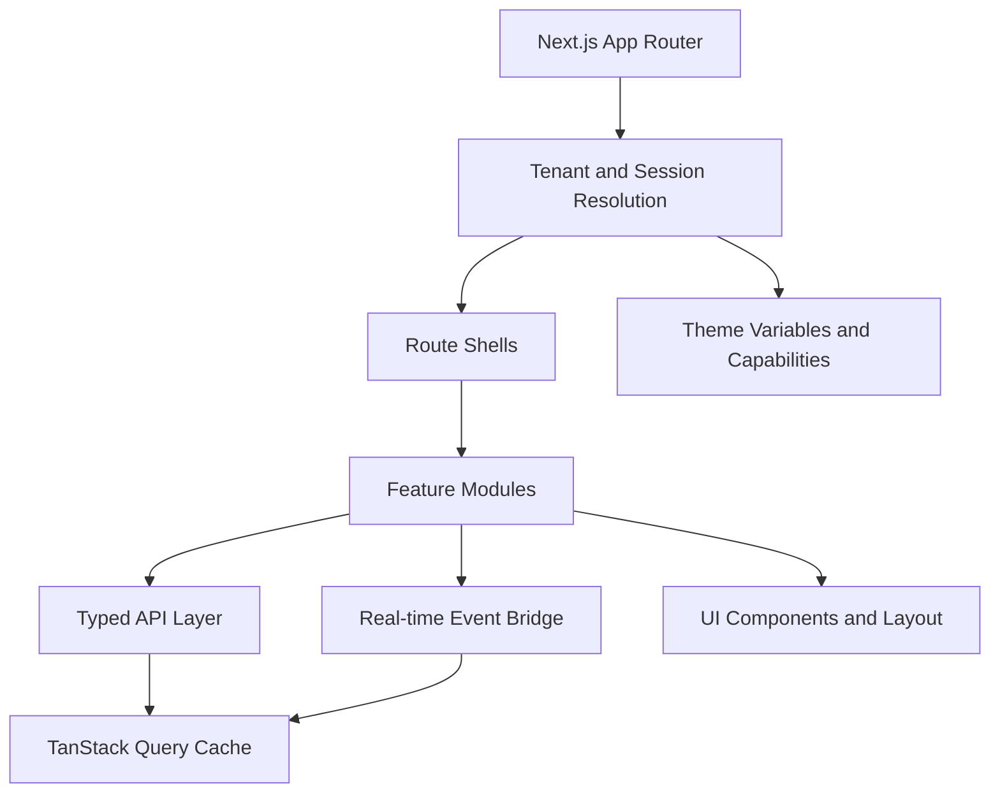
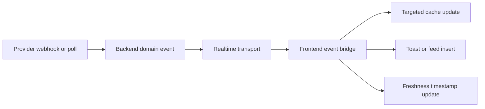

# Festify Affiliates Frontend Architecture

Last updated: 2026-04-07 (refined with gap analysis)

## Source note

This document is based on the Festify Affiliates PRD content contained in the supplied PDF. The first 12 pages contain the relevant product definition for Festify Affiliates. The later pages appear to include unrelated chat transcript content, so the architecture below uses the PRD sections only.

## 1. Product context

Festify Affiliates is not a generic dashboard app. It is a multi-tenant affiliate attribution product for event organizers and affiliate partners, with these core constraints:

- Two main product experiences:
  - Organizer Admin Panel
  - White-labeled Affiliate Portal
- Event-scoped application flows
- White-label branding per organizer, including custom domain support
- Real-time or near-real-time attribution updates from ticketing providers
- Financially sensitive data: sales, commissions, milestone unlocks, payouts
- Heavy list and reporting surfaces: affiliates, sales, assets, payouts, activity
- Shared backend with provider integrations, webhooks, polling, and attribution rules

This means the frontend must optimize for state correctness, tenancy isolation, typed data contracts, and controlled real-time updates more than flashy UI.

## 2. Architecture goals

The frontend must be:

- Modular by business capability, not by page file sprawl
- Tenant-aware at every boundary
- API-driven and contract-safe
- Real-time capable without making financial data feel inconsistent
- White-label ready through runtime theming
- Scalable for multiple organizer campaigns and affiliate roles
- Observable, testable, and resilient under partial backend latency

## 3. Improvements over the initial proposal

Your starting proposal is directionally strong, but for a production financial dashboard there are a few important changes to make.

### 3.1 State cannot be modeled as only "React Query + Zustand"

The original proposal collapses too much state into two buckets. In production, we need five distinct state classes:

| State type | Owner | Examples | Storage |
| --- | --- | --- | --- |
| Server state | Backend | sales, affiliates, payouts, assets, activity feed | TanStack Query |
| URL state | Router | filters, sort, pagination, active campaign | search params |
| Form state | UI form boundary | onboarding forms, settings, campaign editors | React Hook Form + Zod |
| Session and tenant state | Server layout | session, role, tenant branding, permissions | server-resolved context |
| Ephemeral UI state | Client shell | drawers, modals, command palette, toasts | Zustand |

Why this matters:

- Filters and pagination should be shareable and reload-safe, so they belong in the URL.
- Auth and tenant should not live in Zustand as the source of truth.
- Financial records should not be duplicated between Query cache and client stores.

### 3.2 Theme tokens should not live only in TypeScript

The original `tokens.ts` example is too static for white-label SaaS. A branded organizer portal needs runtime theme injection, which is best done with semantic CSS variables, not a plain TypeScript object.

Use:

- brand tokens from organizer config
- semantic tokens exposed as CSS variables
- component styles mapped to semantic tokens

Do not rely on:

- hardcoded hex colors inside components
- a compile-time theme object as the only theme source

### 3.3 Real-time updates need an event bridge, not only `invalidateQueries`

`socket.on("sale_created", invalidateQueries)` is fine for a prototype, but too blunt for a data-heavy dashboard.

Production frontend should use:

- typed domain events
- event normalization
- targeted cache updates when safe
- selective invalidation when recomputation is needed
- visible "last updated" and sync health indicators

This matters because sales, earnings, milestone progress, and payout totals are derived from one another. Naive invalidation can create thrash, flicker, and temporary inconsistency.

### 3.4 Routing must be tenant-aware, not only role-aware

The original route sketch separates `admin`, `affiliate`, and `auth`, but a white-label product also needs host-based tenant resolution and campaign context.

The frontend should support:

- organizer custom domains
- subdomain-based fallback tenancy
- canonical internal URLs for support and ops
- event-scoped application pages

### 3.5 Role checks should not happen only in components

`if (user.role === "organizer")` is not enough.

Access control should be:

- enforced on the server at layout/page boundaries
- represented as a capability object in the client
- scoped by tenant and campaign

This is important because one user may be:

- an organizer admin in one tenant
- an affiliate in another tenant
- a support user with read-only access in an internal workspace

### 3.6 Heavy sales tables need virtualization and URL-driven state

For a data-heavy sales page, memoization alone is not the answer.

Use:

- server-side pagination
- column-based filters in the URL
- virtualized rows for long tables
- separate summary queries from list queries
- background refresh tuned to surface importance

### 3.7 Financial UX needs explicit freshness semantics

This is the biggest missing piece in the original proposal.

Ticketing data may arrive from:

- webhook-driven providers
- polling-driven providers
- delayed refunds

So the frontend must show:

- last synced at
- provider sync status
- pending reconciliation state
- warning when numbers may still be settling

In a financial attribution product, "real-time capable" is less important than "trustworthy and understandable."

## 4. Recommended frontend stack

### Core

- Next.js App Router
- TypeScript
- Tailwind CSS
- shadcn/ui

### State and data

- TanStack Query for server state
- Zustand for ephemeral shell state only
- React Hook Form + Zod for forms and validation
- Native search params or a thin helper for URL state

### Data-heavy UI

- Recharts for charts
- TanStack Table for tables
- TanStack Virtual for row virtualization on large lists

### Real-time

- Transport abstraction that can use SSE first and WebSocket later

Reason:

- Most Festify real-time use cases are server-to-client notifications, not bidirectional collaboration.
- SSE is simpler for dashboards.
- Keep the client interface transport-agnostic so WebSocket can be introduced without refactoring modules.

### Observability

- Sentry for exceptions and performance
- PostHog for product analytics and feature usage

## 5. Experience map

The frontend is made of four experience groups:

### 5.1 Public application experience

- Event-specific affiliate application pages
- Organizer-branded public landing surface
- Approval status and invitation flows

### 5.2 Organizer Admin Panel

- Dashboard
- Campaign setup
- Affiliate review and management
- Sales and revenue reporting
- Asset library and broadcast
- Milestones and rewards
- Payouts
- Branding and integrations

### 5.3 Affiliate Portal

- Earnings overview
- Referral link and discount code
- Assets hub
- Milestone tracker
- Activity feed
- Sales breakdown
- Payout history
- Notification preferences

### 5.4 Shared system surfaces

- Auth
- Session switching
- Error states
- Notifications
- Settings
- Support surfaces

## 6. High-level architecture



## 7. Route topology

The route system should model tenancy, role, and product surface separately.

### Recommended approach

- Resolve tenant from host header first
- Fall back to canonical slug-based URLs
- Keep organizer and affiliate shells separated
- Keep public application flows independent from authenticated shells

### Example route structure

```text
src/app/
  (public)/
    apply/
      [campaignSlug]/
        page.tsx
        loading.tsx
        error.tsx

  (auth)/
    sign-in/page.tsx
    invite/[token]/page.tsx
    reset-password/page.tsx

  (organizer)/
    o/[tenantSlug]/
      layout.tsx
      dashboard/page.tsx
      campaigns/[campaignId]/page.tsx
      campaigns/[campaignId]/affiliates/page.tsx
      campaigns/[campaignId]/affiliates/[affiliateId]/page.tsx
      campaigns/[campaignId]/sales/page.tsx
      campaigns/[campaignId]/assets/page.tsx
      campaigns/[campaignId]/milestones/page.tsx
      campaigns/[campaignId]/payouts/page.tsx
      campaigns/[campaignId]/communications/page.tsx
      branding/page.tsx
      integrations/page.tsx
      settings/page.tsx

  (affiliate)/
    portal/
      layout.tsx
      dashboard/page.tsx
      campaigns/[campaignId]/page.tsx
      campaigns/[campaignId]/assets/page.tsx
      campaigns/[campaignId]/sales/page.tsx
      campaigns/[campaignId]/payouts/page.tsx
      settings/page.tsx
```

### Important note

Branded tenant domains should not require tenant slug in the visible URL. The app should resolve tenant context from the host and inject it into server layouts. Canonical slug routes remain useful for fallback access, support tooling, and preview environments.

## 8. App layer responsibilities

The App Router should stay thin.

Each route file should mainly do four things:

1. Resolve tenant, campaign, and session context
2. Enforce access control
3. Prefetch or stream initial data
4. Compose feature modules

Route files should not own business logic, table config, or data normalization. That belongs in modules.

## 9. Module architecture

The frontend should be modular by capability rather than by page.

### Recommended business modules

| Module | Owns |
| --- | --- |
| `auth` | session hooks, capability mapping, sign-in flows |
| `tenant-shell` | tenant context, brand config, role switching, layout guards |
| `campaigns` | campaign summary, config, status, routing context |
| `dashboard` | aggregated KPIs, charts, feed summaries |
| `affiliates` | review queue, profiles, performance, approval actions |
| `sales` | attribution tables, filters, summaries, charts |
| `assets` | asset library, tagging, previews, download tracking |
| `milestones` | definitions, progress, unlock states |
| `payouts` | earned/pending/paid states, exports, payout history |
| `communications` | broadcasts, announcement history, audience targeting |
| `feature-flags` | rollout controls, experiments, gated UI capabilities |
| `settings` | branding, integrations, notification preferences |
| `realtime` | event transport, versioned event normalization, reducer pipeline, cache fanout |

### Why this is better than the original module list

Your original list was close, but it missed:

- `campaigns` as the top-level unit of configuration and scoping
- `payouts` as a first-class financial surface
- `communications` as a product area from the PRD
- `tenant-shell` as the module that handles multi-tenant complexity cleanly

## 10. Recommended folder structure

```text
src/
  app/

  modules/
    auth/
      api/
      components/
      hooks/
      schemas.ts
      types.ts

    tenant-shell/
      components/
      hooks/
      permissions.ts
      theme.ts
      types.ts

    campaigns/
      api/
      components/
      hooks/
      query-keys.ts
      schemas.ts

    dashboard/
      api/
      components/
      hooks/
      query-keys.ts

    affiliates/
      api/
      components/
      hooks/
      query-keys.ts
      table-columns.tsx

    sales/
      api/
      components/
      hooks/
      query-keys.ts
      filters.ts
      table-columns.tsx

    assets/
      api/
      components/
      hooks/
      query-keys.ts

    milestones/
      api/
      components/
      hooks/
      query-keys.ts

    payouts/
      api/
      components/
      hooks/
      query-keys.ts

    communications/
      api/
      components/
      hooks/
      query-keys.ts

    feature-flags/
      hooks/
      types.ts

    settings/
      api/
      components/
      hooks/
      query-keys.ts

    realtime/
      events.ts
      event-handlers.ts
      provider.tsx
      broadcast-sync.ts
      connection-store.ts
      use-event-bridge.ts

  components/
    ui/
    layout/
    feedback/
    charts/
    data-display/

  lib/
    api/
      client.ts
      errors.ts
      auth.ts
    env.ts
    formatters/
    telemetry/
    utils/

  providers/
    app-providers.tsx
    query-provider.tsx
    theme-provider.tsx
    realtime-provider.tsx

  stores/
    ui-store.ts

  styles/
    globals.css
    theme.css
```

### Boundary rules

- `app/` composes, but does not implement domain logic
- `modules/` own business capability logic
- `components/ui/` never imports from `modules/`
- `stores/` never duplicate server data
- `lib/api/` contains shared primitives, not feature-specific query hooks

## 11. Data fetching architecture

### Required pattern

```text
Route shell -> module hook -> typed API client -> backend endpoint
```

### Route shell pattern

Use Server Components to:

- resolve tenant, session, permissions
- load theme and capability context
- prefetch critical above-the-fold queries when helpful
- stream non-critical panels behind Suspense

Use Client Components to:

- render interactive tables and charts
- handle filters, tabs, modals, and mutations
- subscribe to real-time updates

### API client guidelines

The API layer should be:

- typed
- schema-validated
- tenant-aware
- error-normalized

Avoid raw `axios.get("/sales")` calls scattered around the app.

Instead:

```ts
export async function getCampaignSalesList(
  input: GetCampaignSalesListInput,
): Promise<GetCampaignSalesListResponse> {
  const response = await apiClient.get(`/campaigns/${input.campaignId}/sales`, {
    searchParams: input.filters,
  });

  return getCampaignSalesListResponseSchema.parse(response);
}
```

### Query key strategy

Query keys must encode tenant scope and entity scope.

```ts
export const salesKeys = {
  all: (tenantId: string, campaignId: string) =>
    ["tenant", tenantId, "campaign", campaignId, "sales"] as const,

  list: (
    tenantId: string,
    campaignId: string,
    filters: SalesFilterState,
  ) => [...salesKeys.all(tenantId, campaignId), "list", filters] as const,

  summary: (tenantId: string, campaignId: string) =>
    [...salesKeys.all(tenantId, campaignId), "summary"] as const,
};
```

Without tenant-aware keys, cache bleed between organizers becomes a real risk.

## 12. State management strategy

### Server state: TanStack Query

Use Query for:

- lists
- detail records
- KPI summaries
- feed items
- integration status
- notifications backed by the server

Rules:

- query data is the source of truth for server-owned records
- financial summaries should prefer confirmed backend values over optimistic math
- cache time and refetch interval should vary by surface

### URL state

Use search params for:

- filters
- sort
- page number
- active campaign
- date ranges
- selected tab when it changes shareable meaning

Rules:

- the sales page should restore exactly on refresh
- copied URLs should preserve the user’s analytical context

### Client UI state: Zustand

Use Zustand for:

- sidebar collapse
- modal visibility
- command palette
- client-only view preferences

Do not use Zustand for:

- auth session
- tenant identity
- sales records
- payout totals

### Form state

Use React Hook Form + Zod for:

- affiliate application form
- campaign setup
- branding forms
- integration config
- notification preferences

### Consistency model

The frontend should not treat all mutations the same. Each domain needs an explicit UI consistency rule.

| Surface | Update model | Why |
| --- | --- | --- |
| Sales, commissions, payouts, milestone totals | Pessimistic / backend authoritative | Financial correctness matters more than perceived speed |
| Affiliate approvals | Server-confirmed, then cache update | Business action with downstream side effects |
| Asset uploads and draft metadata | Optimistic with rollback | UX benefit is high and financial risk is low |
| Notification preferences | Optimistic with visible retry | User-owned settings with low systemic risk |
| Shell preferences | Local optimistic | Client-only state |

Rules:

- do not optimistic-update money totals
- do not derive payout status transitions locally
- allow optimistic UX only where rollback is straightforward and harmless

### Multi-tab state sync

For authenticated shells, use `BroadcastChannel` or an equivalent abstraction to synchronize:

- logout/session invalidation
- tenant switch
- cache bust signals after critical mutations
- realtime connection state when helpful

This reduces stale-state confusion when organizers keep multiple tabs open.

## 13. Real-time architecture

### Real-time use cases

- sale created
- sale refunded
- commission updated
- milestone unlocked
- asset published
- organizer broadcast sent
- payout marked paid

### Recommended event pipeline



### Event contract

All events should share a stable envelope:

```ts
type DomainEvent<TPayload> = {
  id: string;
  type:
    | "sale.created"
    | "sale.refunded"
    | "asset.published"
    | "milestone.unlocked"
    | "commission.updated"
    | "payout.updated"
    | "announcement.sent";
  version: number;
  tenantId: string;
  campaignId?: string;
  occurredAt: string;
  correlationId?: string;
  payload: TPayload;
};
```

### Event bridge pipeline

The realtime layer should be a single pipeline, not scattered listeners.

```text
transport -> event decoder -> version guard -> reducer handler -> cache update -> UI side effects
```

Recommended handler registry:

```ts
const eventHandlers = {
  "sale.created": handleSaleCreated,
  "sale.refunded": handleSaleRefunded,
  "commission.updated": handleCommissionUpdated,
  "milestone.unlocked": handleMilestoneUnlocked,
  "asset.published": handleAssetPublished,
} satisfies Record<string, EventHandler>;
```

Rules:

- all cache updates go through reducer handlers
- unknown event versions are ignored and logged
- handlers must be tenant- and campaign-safe
- money-related handlers prefer summary invalidation over local recomputation when uncertain

### Event handling rules

- update the smallest safe cache slice possible
- invalidate summaries when backend aggregation is authoritative
- avoid recomputing money client-side if the backend owns the calculation
- log dropped or unknown events to telemetry

### Connection and degradation strategy

The realtime layer must expose connection state:

- `connecting`
- `live`
- `reconnecting`
- `degraded`
- `offline`

Required behavior:

- exponential backoff reconnects
- fallback polling for critical surfaces when stream health is degraded
- visible reconnect status in organizer and affiliate shells
- automatic freshness downgrade when the last successful event is too old

### Data freshness model

Render one shared freshness model across the app:

| State | Meaning |
| --- | --- |
| `live` | stream connected and recent updates active |
| `syncing` | backend processing or refetch in progress |
| `stale` | no recent update, but data may still be usable |
| `delayed` | provider lag or reconciliation delay detected |
| `offline` | client cannot currently verify freshness |

### Freshness UX

Every real-time surface should show one of:

- Live
- Updated 2m ago
- Sync delayed
- Provider polling

This is especially important when providers differ in latency.

## 14. Multi-tenancy architecture

### Tenant resolution

Resolve tenant from:

1. custom domain
2. branded subdomain
3. fallback canonical slug route

Tenant resolution should happen before rendering route shells.

### Tenant context should contain

- tenant id
- organizer metadata
- branding config
- enabled features
- allowed roles and capabilities
- active campaign context where relevant

### Capability model

Instead of only role strings, expose capabilities such as:

- `campaigns.manage`
- `affiliates.review`
- `assets.publish`
- `sales.view`
- `payouts.manage`
- `branding.edit`

This scales better than hardcoded role checks.

## 15. White-label theming architecture

### Theming approach

Use runtime CSS variables with semantic tokens:

```css
:root {
  --color-bg: oklch(0.98 0.01 250);
  --color-surface: oklch(1 0 0);
  --color-text: oklch(0.22 0.02 255);
  --color-primary: oklch(0.63 0.18 255);
  --color-primary-foreground: oklch(0.99 0.01 255);
  --color-border: oklch(0.9 0.01 255);
  --radius-md: 0.75rem;
}
```

At runtime, map organizer branding into those variables:

```ts
export function buildTenantThemeVars(branding: OrganizerBranding) {
  return {
    "--color-primary": branding.primaryColor,
    "--logo-url": `url(${branding.logoUrl})`,
  } as React.CSSProperties;
}
```

### Theme requirements

- semantic tokens only, not component-specific color names
- chart tokens included for analytics pages
- contrast validation on admin branding form
- graceful fallback when branding config is incomplete

### Important improvement

The theme should be resolved on the server and applied before the first paint. Do not wait for a client-side theme fetch or the portal will flash the wrong brand.

## 16. Auth and access control

### Auth model

- httpOnly secure session cookie
- server-side session resolution in layouts and actions
- mutation requests authenticated by cookie, not localStorage JWT

### Access control model

- enforce permission checks server-side
- expose capabilities client-side for rendering
- keep action buttons hidden if not permitted
- never rely on client gating for security

### Session UX

The app should support:

- organizer admin shell
- affiliate shell
- eventual multi-campaign affiliate switching
- eventual multi-tenant role switching for users with mixed access

### Feature flag access

Feature flags should be resolved server-side with tenant context and exposed client-side as read-only capabilities for:

- staged rollouts
- beta surfaces
- safe migrations
- A/B tests where appropriate

The client may hide or reveal UI with flags, but sensitive operations must still be enforced server-side.

## 17. Design system architecture

### Layer 1: primitives

- Button
- Input
- Select
- Dialog
- Sheet
- Tooltip
- Card
- Badge

### Layer 2: data-heavy composites

- DataTable
- FilterBar
- KPIStatCard
- TrendBadge
- ActivityTimeline
- EmptyState
- ErrorState
- SkeletonBlock
- PagedTableToolbar

### Layer 3: feature components

- AffiliateReviewTable
- SalesBreakdownTable
- MilestoneProgressRail
- AssetLibraryGrid
- CommissionSummaryPanel
- ReferralLinkCard
- ReferralDiagnosticsPanel
- AttributionTracePanel
- OrganizerBroadcastComposer

### Design system rules

- shared components become shared only after at least two modules use them
- every async surface must have loading, empty, error, and partial-data states
- charts and tables must inherit tenant theme tokens safely
- mobile support is functional, but organizer workflows remain desktop-first

### Accessibility strategy

The design system must enforce:

- keyboard-accessible navigation for tables, dialogs, menus, and tabs
- visible focus states across white-label themes
- semantic headings and landmarks
- contrast validation for tenant branding choices
- screen-reader labels for chart summaries and status indicators

Accessibility rules should live in shared components so individual feature teams do not re-solve them ad hoc.

## 18. Page architecture by surface

### Organizer dashboard

Use aggregated endpoints only.

Panels:

- total affiliate-driven revenue
- total commissions
- top affiliates
- conversion trend
- campaign status
- recent activity
- integration health

Do not render the dashboard by stitching together raw list endpoints in the client.

### Affiliate dashboard

Panels:

- earnings overview
- referral link and code
- milestone tracker
- latest assets
- activity feed
- payout summary

This page should feel fast, focused, and motivational.

Add:

- freshness badge for earnings state
- referral diagnostics entry point
- clear explanation when numbers are settling or delayed

### Sales page

Split into:

- summary query
- chart query
- paginated list query

Requirements:

- server-side filtering and pagination
- query-param persistence
- virtualized row rendering when appropriate
- export action handled as background job for large ranges

Add:

- attribution evidence columns or drawer for support workflows
- row-level freshness or reconciliation markers where needed
- trace link to explain sale -> attribution -> commission lineage

### Assets page

Requirements:

- grid and list modes
- tags
- preview drawer
- download tracking
- "new" indicators
- lazy-loaded previews

Optimistic actions are acceptable for non-financial metadata, but publish state should still reconcile with the backend before broad fanout indicators are shown.

### Milestones page

Requirements:

- tier cards
- threshold progress
- unlocked status
- manual review state for organizer-approved rewards

### Payouts page

Requirements:

- earned, pending, paid states
- exportable reports
- audit-friendly timeline
- explicit refund adjustment notes

This page should use backend-confirmed states only. No optimistic payout status transitions.

### Referral diagnostics and lineage surfaces

Expose support-friendly UI for:

- referral link preview and copy diagnostics
- tracking status for a given affiliate campaign link
- sale -> attribution -> commission explanation panels

These surfaces are especially valuable for dispute handling and organizer trust.

## 19. Error handling and resilience

### Route-level handling

Use route segment `loading.tsx` and `error.tsx` files for:

- organizer shell
- affiliate shell
- public application flow

### Component-level handling

Each async module surface should render:

- loading state
- empty state
- error state
- stale data warning where relevant

### Recovery UX

Every failure mode should define the recovery action.

Examples:

- failed query -> inline retry action
- failed mutation -> rollback optimistic state if used, then toast with retry
- realtime disconnect -> reconnect banner and fallback polling
- provider delay -> non-error warning with last sync time
- permission failure -> explain why the action is unavailable

### Error taxonomy

Frontend should distinguish:

- auth errors
- permission errors
- validation errors
- upstream provider lag
- network failures
- unknown server errors

### Important financial rule

When totals and lists disagree due to eventual consistency, the UI should:

- preserve backend summary totals as authoritative
- show that detailed records are catching up
- never silently fabricate numbers client-side

## 20. Rendering strategy

### Partial rendering model

Not every panel should block initial render.

Classify surfaces as:

- critical: tenant shell, auth, top KPI summary, primary actions
- secondary: activity feed, charts, side panels, diagnostics drawers

Rules:

- critical organizer and affiliate summary panels may be prefetched or streamed first
- secondary analytical panels should render behind Suspense
- diagnostics and trace panels should lazy-load on demand

This keeps the app fast without hiding important financial context.

## 21. Performance strategy

### Rendering

- use Server Components for shells and initial context
- stream secondary panels with Suspense
- code-split heavy charts and editors
- avoid turning entire dashboards into client-only trees

### Data

- prefetch only above-the-fold essentials
- tune refetch intervals by page type
- keep list queries paginated
- separate dashboard aggregates from tables

### Tables

- server-side pagination
- virtualization for long lists
- URL-driven filters
- defer expensive export jobs to the backend

### Assets

- CDN URLs
- responsive images
- lazy loading
- preview on demand

### Real-time

- subscribe only for active tenant and active campaign
- pause or reduce update frequency on background tabs if supported

## 22. Observability

### Sentry

Track:

- route rendering errors
- mutation failures
- event bridge failures
- slow page loads
- API latency outliers
- realtime disconnect loops
- handler version mismatches

### PostHog

Track:

- affiliate application completion
- approval conversion
- asset download usage
- milestone engagement
- organizer broadcast usage
- campaign switch behavior

### Product-health telemetry

Also log:

- provider sync lag
- real-time connection health
- cache update failures
- stale-data banner impressions
- freshness state transitions
- retry-action usage
- referral diagnostic panel usage

## 23. Testing strategy

### Unit tests

- query key builders
- schema parsers
- permission mapping
- event bridge reducers
- formatter utilities
- freshness state derivation
- feature flag gating rules

### Integration tests

- feature hooks against mocked API responses
- route shell access control
- theming variable injection
- query invalidation and targeted updates
- reconnect and fallback polling behavior
- multi-tab sync signals

### End-to-end tests

- affiliate application flow
- organizer approval flow
- organizer asset push -> affiliate portal update
- new sale -> dashboard summary update
- payout status update visibility
- referral diagnostics visibility
- attribution trace drawer behavior

### Visual regression

Recommended for:

- white-label themes
- charts
- table density variants
- milestone states

## 24. Delivery plan

### Phase 1: foundation

- App Router shells
- tenant resolution
- auth and capabilities
- query provider
- design tokens and theme injection
- dashboard skeletons
- feature flag plumbing
- baseline freshness model

### Phase 2: core workflows

- public application flow
- organizer dashboard
- affiliates module
- assets module
- affiliate dashboard
- milestone tracker
- reducer-driven realtime event bridge
- retry and recovery UX

### Phase 3: attribution and reporting

- sales tables and charts
- payout workflows
- provider sync status
- activity feed
- download tracking
- attribution trace UI
- referral diagnostics

### Phase 4: real-time and scale

- event bridge
- live activity updates
- advanced analytics
- multi-event affiliate switching
- custom domain hardening
- multi-tab sync
- richer connection degradation handling

## 25. Internationalization and localization

### Why this matters

Festify is an event platform with global organizers and affiliates. Even if the initial launch is English-only, the architecture must not make i18n a retrofit.

### Recommended approach

- use `next-intl` or `next-i18next` for string management
- locale resolved from: user preference → tenant default → browser `Accept-Language` → `en`
- all user-facing strings in translation files, never hardcoded in components
- ICU MessageFormat for plurals, numbers, and gendered text

### What to localize

- UI labels, tooltips, error messages
- date and time formatting (use `Intl.DateTimeFormat` with tenant timezone)
- number and currency formatting (use `Intl.NumberFormat`)
- email templates (server-side, not frontend)

### What not to localize in phase 1

- organizer-created content (campaign names, asset titles, announcements)
- admin-only ops surfaces

### Folder structure

```text
src/
  messages/
    en.json
    es.json
    fr.json
    ...
```

### Important rule

Never concatenate translated strings. Use interpolation variables in message templates.

## 26. SEO and public page optimization

### Why this matters

Public affiliate application pages and organizer landing surfaces are discoverable by search engines. These are lead-generation surfaces and must be optimized.

### Metadata strategy

- use Next.js `generateMetadata` for dynamic per-page titles, descriptions, and Open Graph tags
- organizer branding (logo, name, colors) should populate OG images
- campaign application pages should have unique, crawlable URLs

### Structured data

- `Event` schema markup on campaign application pages
- `Organization` schema on organizer landing surfaces
- `BreadcrumbList` for navigation context

### Rendering

- public pages must be Server-Side Rendered or statically generated
- authenticated dashboard pages do not need SEO and should use `noindex`

### Sitemap

- generate a dynamic sitemap for public campaign application pages
- exclude authenticated routes

### Performance for public pages

- target Core Web Vitals: LCP < 2.5s, CLS < 0.1, INP < 200ms
- preload hero images and fonts
- minimize JavaScript on public pages

## 27. Security hardening

### Content Security Policy (CSP)

- configure strict CSP headers via Next.js middleware
- allow only trusted script sources (self, analytics, Sentry)
- block inline scripts except nonce-based where necessary
- restrict frame-ancestors to prevent clickjacking

### XSS prevention

- React handles output encoding by default — never use `dangerouslySetInnerHTML` with user content
- sanitize any organizer-provided HTML (branding descriptions, announcement bodies) with a strict allowlist (DOMPurify)
- validate and sanitize URL inputs (referral links, redirect targets)

### CSRF protection

- session cookies use `SameSite=Lax` or `Strict`
- server actions and mutations validate origin headers
- no sensitive operations via GET requests

### Dependency security

- `pnpm audit` in CI pipeline
- automated dependency update scanning (Dependabot or Renovate)
- lock file integrity checks

### Sensitive data in the client

- never expose tenant secrets, API keys, or provider credentials to the browser
- affiliate earnings and payout amounts are safe to display but should not be in URL query params
- session tokens are httpOnly cookies, never accessible via JavaScript

## 28. Navigation and layout architecture

### Shell navigation model

The app has two primary shells with distinct navigation patterns:

**Organizer shell:**
- persistent sidebar with campaign switcher at top
- sidebar sections: Dashboard, Campaigns (expandable), Affiliates, Assets, Payouts, Communications, Branding, Integrations, Settings
- breadcrumb trail for nested campaign pages
- command palette (`Cmd+K`) for quick navigation and actions

**Affiliate shell:**
- simplified sidebar or top nav
- campaign context visible but less prominent
- sections: Dashboard, My Links, Assets, Sales, Milestones, Payouts, Settings

### Breadcrumb architecture

- breadcrumbs generated from route segments automatically
- campaign name resolved from cache, not re-fetched
- breadcrumb labels are human-readable (campaign name, not ID)

### Mobile navigation

- sidebar collapses to bottom tab bar on mobile for affiliate portal
- organizer admin uses collapsible drawer on mobile
- critical actions remain accessible via command palette

### Command palette

- global shortcut `Cmd+K`
- search across: campaigns, affiliates, assets, settings pages
- recent actions and pages
- scoped by current tenant and role capabilities

## 29. Copy and clipboard patterns

### Why this matters

Affiliates constantly copy referral links and discount codes. This must be frictionless.

### Recommended UX

- one-click copy button on all referral links and codes
- visual confirmation (checkmark, "Copied!" toast) on successful copy
- copy button accessible via keyboard
- fallback for browsers without Clipboard API (select-all in input)

### Copy targets

- referral link URLs
- discount codes
- tracking UTM-appended URLs
- embed code snippets for assets
- payout reference IDs

## 30. Date, time, and number formatting

### Date and time

- use a single formatting utility wrapping `Intl.DateTimeFormat`
- all dates display in the user's local timezone (resolved from browser or profile setting)
- relative time for recent events ("2 minutes ago", "yesterday")
- absolute time for financial records and audit trails
- date range pickers use tenant timezone for day boundaries

### Numbers and currency

- use `Intl.NumberFormat` with currency code from the sale/commission record
- always show currency symbol alongside amounts
- use consistent decimal precision (2 places for most currencies)
- large numbers use locale-appropriate grouping separators

### Formatting utility location

```text
src/lib/formatters/
  date.ts
  currency.ts
  number.ts
  relative-time.ts
```

### Important rule

Never format currency amounts by string concatenation (e.g., `"$" + amount`). Always use the formatter with the correct currency code.

## 31. Image and media optimization

### Next.js Image

- use `next/image` for all raster images (logos, avatars, asset previews)
- configure `remotePatterns` for CDN and S3 asset domains
- set explicit `width` and `height` or use `fill` with `sizes` to prevent layout shift

### Responsive images

- serve WebP/AVIF formats via CDN or Next.js image optimization
- use `sizes` attribute to serve appropriate resolution per viewport
- lazy-load below-the-fold images with `loading="lazy"`

### Asset previews

- thumbnails generated server-side or via CDN transforms
- full-resolution preview loaded on demand in drawer/modal
- video previews use poster frame with play-on-click

### Organizer branding assets

- logos served from CDN with fallback to default Festify branding
- favicon and OG image dynamically set per tenant
- SVG logos preferred for resolution independence

## 32. Offline resilience and network handling

### Core principle

Festify is not an offline-first app, but it should handle intermittent connectivity gracefully.

### Network status detection

- detect online/offline status via `navigator.onLine` and `online`/`offline` events
- show a non-intrusive banner when offline: "You're offline. Some data may be outdated."
- auto-retry failed queries when connection resumes

### Stale data behavior

- TanStack Query's `staleTime` and `gcTime` keep cached data visible during brief disconnections
- financial data surfaces show last-fetched timestamp prominently when stale
- mutations queue locally and warn users: "This action will be submitted when you're back online" (only for non-financial actions like notification preferences)

### What should NOT work offline

- financial mutations (payout approvals, commission adjustments)
- affiliate application submissions
- any action that changes money or attribution state

### Service worker

- not required for MVP
- consider adding for asset caching and faster repeat loads in phase 4

## 33. Print and export views

### Why this matters

Organizers need printable financial reports for accounting, tax, and compliance.

### Printable surfaces

- payout history and reports
- sales breakdown tables
- commission summaries
- affiliate performance reports

### Implementation

- use `@media print` CSS for print-optimized layouts
- hide navigation, sidebars, and interactive controls in print view
- expand all paginated data or provide "Export All" as a backend job
- print header includes: tenant name, report title, date range, generated-at timestamp

### Export formats

- CSV export for tabular data (sales, commissions, payouts)
- PDF export for formatted reports (triggered as backend job for large datasets)
- export actions show progress and notify on completion

## 34. Frontend CI/CD pipeline

### Build pipeline

- `pnpm lint` — ESLint with strict TypeScript rules
- `pnpm typecheck` — `tsc --noEmit`
- `pnpm test` — Vitest unit and integration tests
- `pnpm build` — Next.js production build
- `pnpm test:e2e` — Playwright end-to-end tests (on CI only)

### Quality gates

- all checks must pass before merge
- bundle size budget enforced (warn on +10%, block on +25%)
- Lighthouse CI for public pages (LCP, CLS, INP thresholds)
- visual regression snapshots reviewed on PR

### Preview deployments

- every PR gets a preview deployment (Vercel preview or equivalent)
- preview URLs include tenant simulation for white-label testing
- preview deployments use staging backend, never production

### Environment variables

- `.env.local` for local development
- `.env.example` committed with placeholder values
- production secrets managed via deployment platform (Vercel env, etc.)
- `src/lib/env.ts` validates required env vars at build time with Zod

## 35. API mocking and development workflow

### MSW (Mock Service Worker)

- use MSW for local development and integration tests
- mock handlers organized by module, matching the backend module structure

```text
src/mocks/
  handlers/
    auth.ts
    campaigns.ts
    sales.ts
    affiliates.ts
    payouts.ts
  browser.ts
  server.ts
```

### Mock data factories

- use factories (e.g., with `@mswjs/data` or custom builders) for consistent test data
- factories match backend Zod schemas to prevent drift
- seed data covers edge cases: empty states, error states, large datasets, multi-tenant scenarios

### Development modes

- `pnpm dev` — runs against local backend (Docker Compose)
- `pnpm dev:mock` — runs against MSW mocks (no backend needed)
- `pnpm dev:staging` — runs against staging backend

### API contract validation

- share Zod schemas between frontend and backend (or generate from OpenAPI spec)
- CI step validates frontend schemas against backend contract on every PR
- schema drift triggers a build warning, not a silent failure

## 36. Component development and documentation

### Storybook

- use Storybook for developing and documenting Layer 1 (primitives) and Layer 2 (composites) components
- each component has stories covering: default, loading, empty, error, and edge-case states
- white-label theme variants shown as story decorators

### Component conventions

- all shared components are in `src/components/`
- feature-specific components stay in their module until reused
- props use explicit interfaces, not inline types
- compound components use dot notation (e.g., `DataTable.Header`, `DataTable.Row`)
- no default exports — all named exports for better refactoring

### Documentation

- Storybook deployed alongside preview environments
- component API documented via JSDoc on prop interfaces
- usage examples in stories, not in separate markdown files

## 37. Multi-tab and session synchronization

### Why this matters

Users commonly have multiple dashboard tabs open. State must stay consistent.

### Session sync

- use `BroadcastChannel` API to sync session state across tabs
- logout in one tab triggers logout in all tabs
- tenant/campaign switch propagates to other tabs

### Data sync

- TanStack Query's `refetchOnWindowFocus` handles basic data freshness
- real-time event bridge connections are per-tab (not shared)
- tabs in background reduce polling frequency

### Conflict handling

- if another tab makes a mutation, background tabs see fresh data on focus
- no cross-tab optimistic updates — each tab manages its own mutation state

## 38. Final recommended architecture statement

Festify Affiliates should be built as a tenant-aware Next.js App Router application with:

- server-resolved tenant and session context
- domain-driven feature modules
- TanStack Query for server state
- URL state for analytics surfaces
- Zustand limited to ephemeral shell state
- runtime CSS-variable theming for white-label branding
- typed API contracts with schema validation
- versioned real-time events with a reducer-driven event bridge
- explicit freshness and degradation handling
- feature-flag-aware rendering
- accessibility baked into shared components
- internationalization-ready string management
- SEO-optimized public surfaces with structured data
- strict security hardening (CSP, XSS prevention, CSRF protection)
- structured navigation with command palette and breadcrumbs
- locale-aware date, time, and currency formatting
- optimized image and media pipeline via CDN and Next.js Image
- graceful offline resilience and network status handling
- print and export views for financial reporting
- CI/CD pipeline with bundle budgets, type checking, and visual regression
- MSW-based API mocking with schema contract validation
- Storybook for component development and documentation
- multi-tab session and data synchronization

This architecture treats the frontend not as "just pages", but as the orchestration layer for a financial attribution system where trust, consistency, tenant isolation, and global accessibility matter as much as UI quality.
